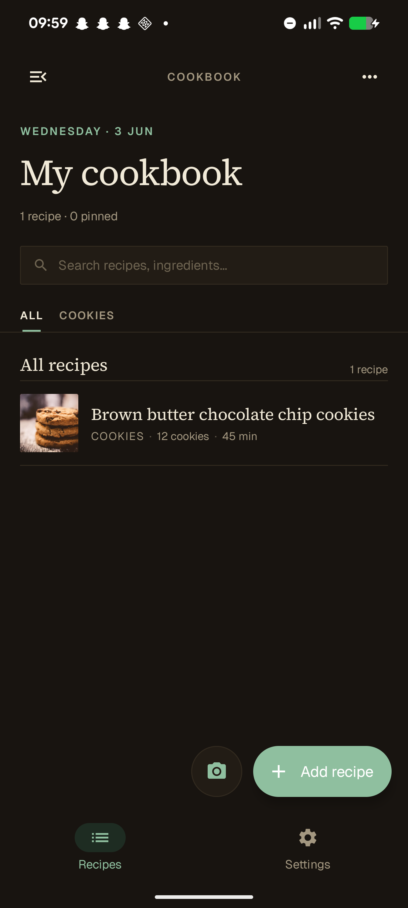
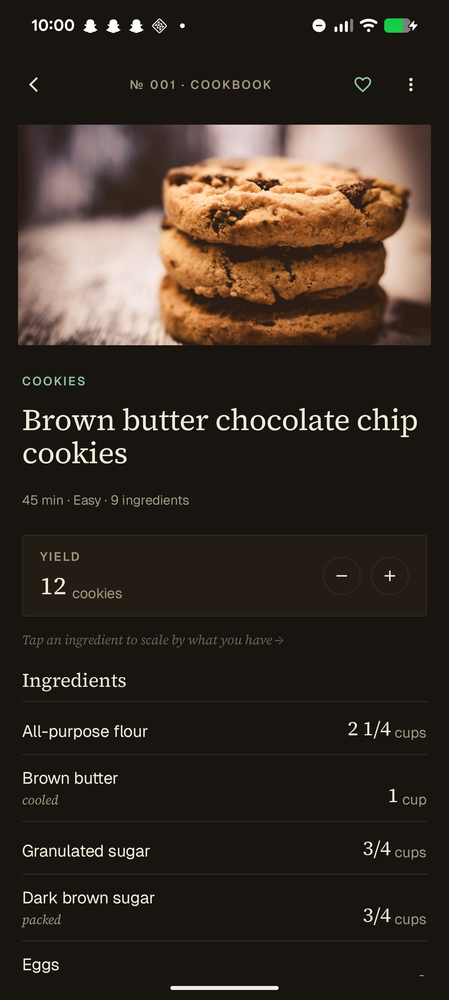
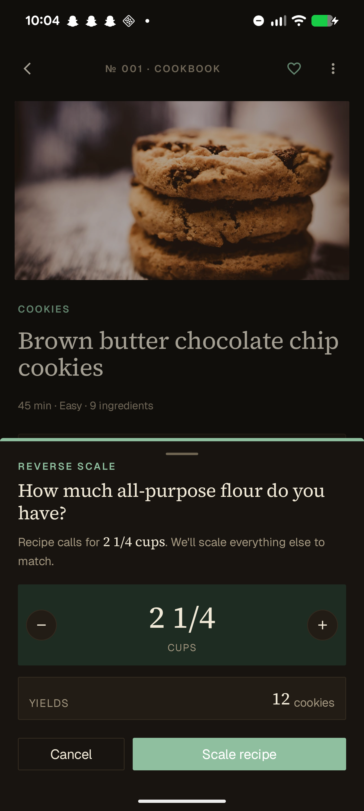
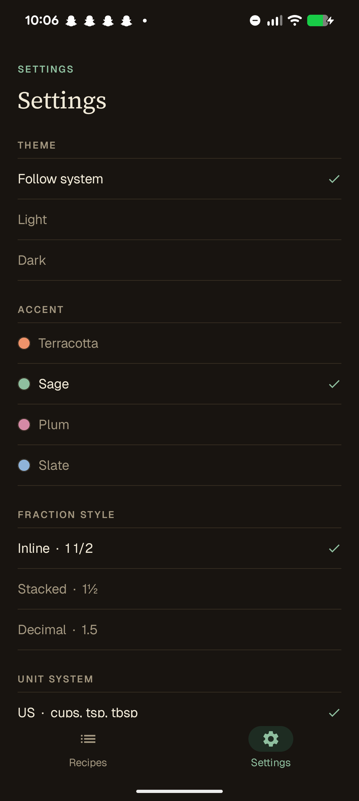

# Recipe Calculator


`v0.5.0` · Kotlin + Jetpack Compose + Material 3 · minSdk 24 · local-only (no accounts, no cloud sync)

<table>
  <tr>
    <td></td>
    <td></td>
    <td></td>
    <td></td>
  </tr>
  <tr align="center">
    <td><sub>Home</sub></td>
    <td><sub>Recipe detail</sub></td>
    <td><sub>Reverse-scale sheet</sub></td>
    <td><sub>Settings &amp; theming</sub></td>
  </tr>
</table>

## What it does

Three things most recipe apps don't.

- **Reverse scaling.** "I have 320 g of flour. How much of everything else?" The reverse-scale
  sheet rescales the whole recipe to fit a limiting ingredient, with a live yield preview.
- **Exact rational quantities.** Quantities are stored as `{ numerator, denominator }` integer
  pairs — never floats. Scaling `1/3 cup` by `3/2` produces `1/2 cup`, not `0.49999…`. Display
  honors a per-user fraction style: `1 1/2`, `1½`, or `1.5`.
- **Ingredient-aware unit conversion.** `1 cup flour` and `1 cup sugar` are different grams.
  A curated density table powers cup↔gram conversion that respects the ingredient, with a
  graceful fallback when the ingredient isn't known.

## OCR capture

Photograph a printed (or on-screen) recipe and the editor seeds itself from the parsed
ingredients. Built around CameraX live preview with pinch-to-zoom, a post-capture crop step
to isolate the ingredient block, and ML Kit on-device Latin text recognition.

The parser handles the failure modes real ML Kit captures actually produce:

- Print checkboxes (☐) hallucinated as a stray `D`/`U`/`O` letter prefix, spaced or glued.
- Metric `g` misread as `9` and fused into the leading number (`175g` → `1759` → recovered
  as `175 g` when followed by an `oz`/`0z`/`lb` imperial alternative).
- Dropped fraction numerators (`1/2 cup` → `/2 cup`, restored as `1/2`).
- Dual metric/imperial notation glued together (`100g/3.5 oz` → keep the metric half).

The `recipetineats_capture_recovers_all_nine_ingredients` test is a verbatim Pixel ML Kit
dump locked in as a snapshot — extending it with each new failure mode is the cheapest
possible regression guard.

## Two flavors: `play` and `portfolio`

The project builds two APKs from one codebase via Gradle product flavors.

| | `play` | `portfolio` |
|---|---|---|
| applicationId | `io.github.chwi.recipecalculator` | `io.github.chwi.recipecalculator.portfolio` |
| Audience | Play Store release | Showcase / interview demo |
| Biometric app lock | — | ✓ AndroidX Biometric (`STRONG \| DEVICE_CREDENTIAL`) |
| Encrypted prefs | — | ✓ `EncryptedSharedPreferences` (Keystore-backed) |
| Play Integrity check on launch | — | ✓ Soft-fail with warning banner |
| Permissions delta | — | `USE_BIOMETRIC` |
| Settings "Security" section | hidden | visible |

Both APKs install side-by-side on a dev device because of the `.portfolio` applicationId suffix.

The split is powered by three interfaces under `core/security/` declared in `src/main/`:
`AppLockController`, `SecurePreferenceStore`, `IntegrityChecker`. Each flavor provides its
own implementation plus a Hilt `SecurityModule` that `@Binds` it to the interface — same
class name, same package, different source set. UI code injects the interface and never
branches on `BuildConfig.FLAVOR`.

```kotlin
// src/play/.../security/SecurityModule.kt
@Binds abstract fun bindAppLock(impl: NoOpAppLockController): AppLockController

// src/portfolio/.../security/SecurityModule.kt — same module, real impl
@Binds abstract fun bindAppLock(impl: BiometricAppLockController): AppLockController
```

Scoped backup rules (`res/xml/{backup_rules,data_extraction_rules}.xml`) ship in both
flavors and exclude device-bound files (Keystore-encrypted prefs, OCR temp captures) from
Google's auto-backup.

## Stack

| Layer | Choice |
|---|---|
| Language / UI | Kotlin 2.2 · Jetpack Compose + Material 3 (no XML layouts) |
| Architecture | MVVM, unidirectional state, Coroutines + Flow |
| DI | Hilt 2.59 |
| Persistence | Room 2.8 (local-only) · DataStore Preferences |
| Navigation | Navigation Compose, type-safe routes |
| OCR | CameraX 1.4 + ML Kit Latin text recognition (on-device) |
| Security *(portfolio)* | AndroidX Biometric · `security-crypto` (`EncryptedSharedPreferences`) · Play Integrity API |
| Build | Gradle Kotlin DSL + version catalog · AGP 9.2 · minSdk 24 / target 36 |
| Tests | JUnit 4 + Turbine · Compose UI tests · Room schema migration tests |

## Engineering discipline

- Pure-function libraries (`core/rational`, `core/units`, `core/parser`) live behind their
  own modules and carry their own unit tests — the parser has 45.
- Room schemas are exported and verified in instrumented migration tests.
- Type-safe nav routes via the Navigation Compose type-safe API — no string keys.
- No `BuildConfig.FLAVOR` conditionals in UI code; flavor differences live behind DI seams.
- Each phase ships as a tagged release: `v0.1.0` through `v0.5.0`.

## Build & run

Requires JDK 17+ (the toolchain here uses Android Studio's bundled JBR, which is JDK 21).
On the command line, point `JAVA_HOME` at the Android Studio `jbr/` directory.

```bash
# Build either flavor
./gradlew :app:assemblePlayDebug
./gradlew :app:assemblePortfolioDebug

# Install to a connected device
./gradlew :app:installPortfolioDebug

# Run unit tests under either flavor (the parser tests run under both)
./gradlew :app:testPlayDebugUnitTest
./gradlew :app:testPortfolioDebugUnitTest
```

In Android Studio: **View → Tool Windows → Build Variants** to switch between flavors.

## Project layout

```
app/src/
  main/              shared code — everything except the security stack
  play/              play-flavor security no-ops + Hilt bindings
  portfolio/         portfolio-flavor real security impls + USE_BIOMETRIC permission
  test/              shared unit tests (parser, rationals, units, density)
  androidTest/       instrumented tests (Room DAO, schema migrations)

app/src/main/java/io/github/chwi/recipecalculator/
  core/              business logic — rationals, units, density, OCR parser, security interfaces
  data/              Room entities + DAOs + repository + DataStore settings
  ui/                Compose screens — home, detail, editor, capture, settings, security
  navigation/        type-safe routes + nav host
  di/                Hilt modules
```

## Further reading

- [`spec.html`](spec.html) — product spec (data model, architecture, open questions, risks)
- [`PLAN.md`](PLAN.md) — phase-by-phase build plan and changelog
- [`docs/phase4-walkthrough.html`](docs/phase4-walkthrough.html) — explainer of the Phase 4 security stack
- [`docs/gradle-flavors-explainer.html`](docs/gradle-flavors-explainer.html) — how the flavor split works under the hood

## License

© 2026 Christian Hagen Wiker. **All rights reserved.** This source is published for
portfolio review only and is **not** licensed for reuse — see [LICENSE](LICENSE).

---

<sub>Built as a portfolio project targeting the EU/Norway mobile dev market.</sub>
